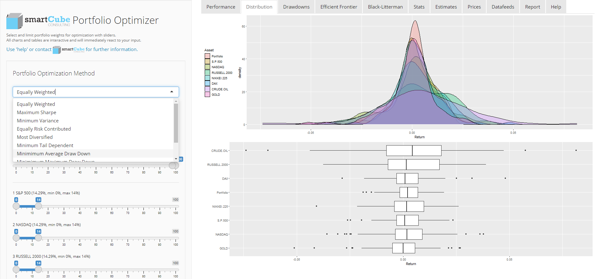
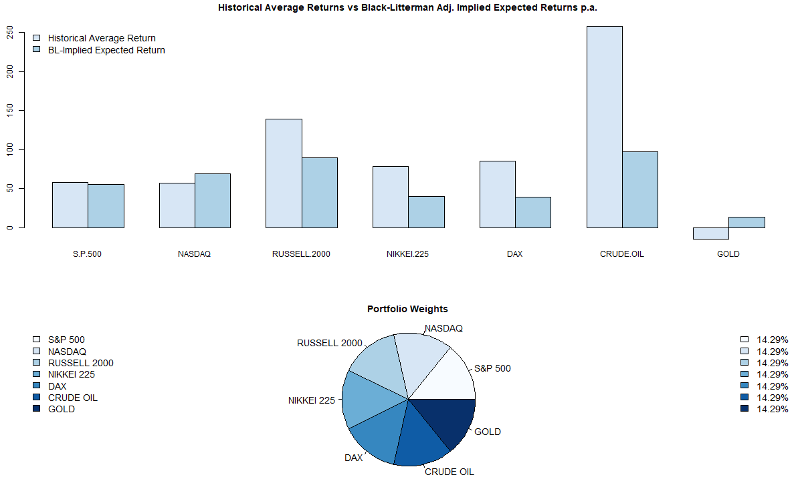

# **Portfolio Optimizer** :bar_chart::unicorn:
## Demoversion available @ https://smartcube.shinyapps.io/portfoliooptimizer
## Professional version @ https://smartcube.shinyapps.io/portfoliosuite
----

**Portfolio Optimizer** allows you to construct optimal portfolios and your own asset allocation via state-of-the-art algorithms from computational finance.
You can view performance charts, calculate the stats and view and save the stock price table of important market indices. 
Use sliders for selecting and constraining portfolio weights and sample size for portfolio optimization.  
All charts and tables are interactive and will immediately react to your input.
The main functions are:
* Portfolio optimization with interactive performance and drawdown charts
* Interactive distribution histograms and boxplots
* Calculation and visualization of the efficient frontier
* Compare historical average returns with Black-Litterman implied expected returns
* Calculate and compare key ratios, manipulate the correlation matrix, f.e. for stress testing purposes
* Print out a report in Word or HTML and PDF (requires installed pandoc)

----
## Optimization

### List of Available Methods

* Equally Weighted
* Maximum Sharpe
    + use your own estimates for expected returns
    + use your own estimates for covariance
* Minimum Variance
    + use your own estimates for expected returns
    + use your own estimates for covariance
* Equally Risk Contributed
* Most Diversified
* Minimum Tail Dependent
* Minimimum Average Draw Down
* Minimimum Maximum Draw Down
* Maximum-Sharpe Portfolio
    + with weights constraints
    + use your own estimates for expected returns
    + use your own estimates for covariance
* Minimum-Variance
    + with weights constraints
    + use your own estimates for expected returns
    + use your own estimates for covariance

----
## Black-Litterman

### Implied Returns

The Black-Litterman model uses "equilibrium" returns as a neutral starting point.  
If you "reset returns to adjusted Black-Litterman values" in the "Estimates" tab panel and then optimize for "maximum Sharpe" on the left sidebar panel you will roughly get equal weighting as the result.

----
## Statistics

### Available Performance and Risk Measures

* Average Return p.a.
* Standard Deviation p.a.%
* Sharpe Ratio (rf=0) p.a.
* Shortfall Probability (1 year)
* Value at Risk 95% Delta-Normal p.a.%
* Value at Risk 95% Cornish-Fisher p.a.%
* Value at Risk 95% Historical p.a.%
* Value at Risk 99% Delta-Normal p.a.%
* Value at Risk 99% Cornish-Fisher p.a.%
* Value at Risk 99% Historical p.a.%
* Positive Returns%
* Maximum Drawdown%
* Skewness
* Kurtosis
* Autocorrelation Lag 1
* Geltner Adj. Average Return p.a.%
* Geltner Adj. Standard Deviation p.a.%
* Black-Litterman Implied Expected Return p.a.%
* Adj. Black-Litterman Implied Expected Return p.a.%
